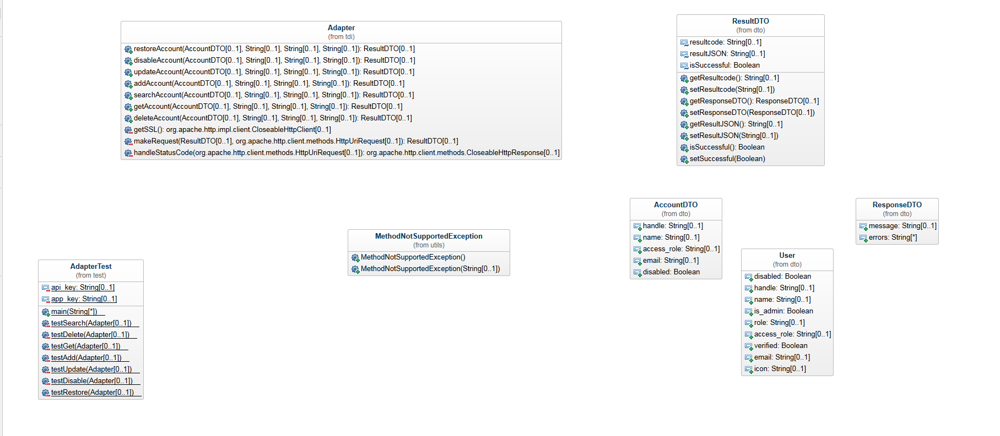

# DataDogAdapter

- Idag så använder Husqvarna ett användargränsnitt (IBM Security Identity Manager) för att göra deras hantering utav användare för olika plattformar/målsystem. För att de ville 
  och kände behovet utav att utöka detta och hantera användare för ett nytt målsystem. Till detta behövdes då en adapter för att kunna hantera användare på det nya målsystemet DataDog.
  
- De teknologier jag har använt
  - Java SE
  - IBM Tivoli Directory Integrator
  - IBM Adapter Development Tool
  - JavaScript
  - Apache HttpComponents
  - Google Gson
  - Log4j
  - Apache Commons Logging

- [Rapporten](Uppsats.md)
  
- [LinkedIn](https://www.linkedin.com/in/alex-arvedahl/)

#### Installationsinstruktioner
Då den inte fungerar direkt ifrån IBM Security Identity Manager så kommer en förklaring hur man installerar den till IBM Tivoli Directory Integrator. 
1. Du laddar ner GitHub repot och kompilerar koden till en jar fil. 
2. Ta jar filen samt biblioteken och lägg in i *ITDI_HOME/jars*
3. Starta sedan om IBM Tivoli Directory Integrator Server
4. Tryck på *Add Component* i antingen en ny eller en befintlig Assembly Line, Välj sedan *Empty Script*
5. Efter detta så kommer du kunna instansiera objekt utifrån dessa Java klasser från jar filen genom att till exempel skriva:
````javascript
adapter = new alex.tdi.Adapter();
````

#### Klassdiagram


