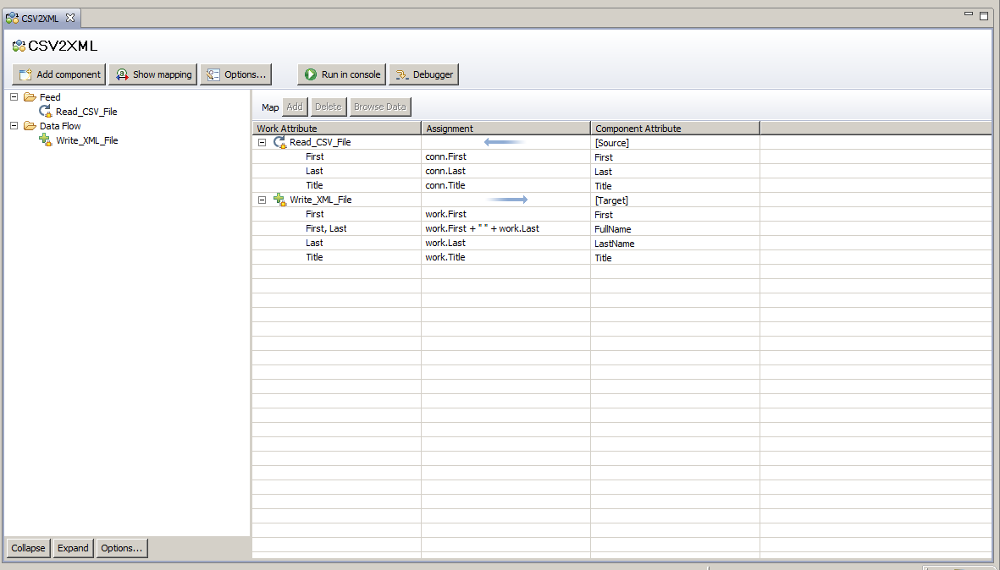

# Adapter till IBM Security Identity Manager
#### En adapter mellan IBM Security Identity Manager och Datadog för hantering av användare

// Scheman eller Schemes?
// byt ut dev miljö till utvecklings miljö
// Läs igenom så ingeting låter dumt

## Inledning utförlig beskrivning av produkten

### Idé - Förklaring till användandet, varför?
Idag så använder Husqvarna ett användargränsnitt (IBM Security Identity Manager) för att göra deras hantering utav användare för olika plattformar/målsystem. För att de ville 
och kände behovet utav att utöka detta och hantera användare för ett nytt målsystem. Till detta behövdes då en adapter för att kunna hantera användare på det nya målsystemet DataDog.

### Mål
Målet med adaptern är att den skall kunna ha möjlighet att hantera användare och göra de följande operationerna:
- Skapa en användare
- Uppdatera en användare
- Ta bort en användare
- Hämta information om en användare

### Syfte
Själva syftet med produkten är att låta främst Global service desk hantera konton åt användare (Återförsäljare och andra anställa på Husqvarna)
hantera konton på målsystemet åt användare i IBM Security Identity Manager.  Eftersom just detta målsystemet DataDog inte hade stöd för någon av 
de existerande adapterna så var jag tvungen att bygga en egen adapter som kan ta emot informationen av en använadre från IBM Security Identity Manager och skicka
de uppgifterna i rätt format till DataDog, detta sker med hjälp utav JSON Rest-API.

### historik över förändringar (motiv, förklaring)
En förändring som jag behövde göra, efter att ha kollat och läst igenom dokumentationen för DataDogs API så såg jag att API:et inte hade stöd för att ta bort användare. Efter
att jag hade diskuterat med min handledare om vad som vore bäst så kom vi fram till att det bästa vore att kasta ett exception som säger att metoden inte stöds.

En annan förändring som jag gjorde med tanke på att API:et inte hade stöd för att ta bort användare, var att eftersom jag såg att API:et hade stöd för att inaktivera 
och aktivera användare så byggde byggde jag stöd för dessa operationer.


## Förklaring av begrepp

1. ISIM
   - IBM Security Identity Manager
   
2. TDI
   - IBM Tivoli Directory Integrator

3. SCIM
   - The System for Cross-domain Identity Management (SCIM) specifikationen är en standard designad för att kunna hantera användarkonton i moln-baserade applikationer lättare.

## Lista på teknologier

- Java SE
  - Java, till skillnad från vissa språk innan det tillåter användning av ord och kommandon istället för bara symboler och siffror. Java tillåter också skapandet av avancerade datatyper som kallas objekt som representerar 
verkliga saker som en stol eller en dator där du kan ställa in attributen för dessa objekt och saker de gör. Java är mycket flexibel - det kan användas för att utveckla programvara såväl som appar. 
Men flexibiliteten slutar inte där eftersom du kan köra samma Java-program på olika operativsystem utan att behöva skriva om koden  (till skillnad från några andra språk som C och C ++) 
tack vare Java-runtime som tolkar Java-kod och berättar operativsystemet vad man ska göra.

   - För att bygga en adapter så krvädes det att antingen så skrev jag flera java-klasser som kompileras till en enda jar fil som sedan IBM Tivoli Directory Integrator skulle använda och anropa metoder. Det andra alternativet var att 
jag kunde skriva ren JavaScript direkt inuti IBM Adapter Development Tool. Då jag känner mig mest bekväm och det programmeringspråk som jag har vid hjärtat är Java så var detta ingen större fundering, utan jag visste direkt 
att jag ville skriva java-klasser till en jar fil. En annan sak som jag tycker underlättar vid själva kodningen är hur mycket enklare det är att lista ut fel, min erfarenhet är att det är lättare och tydligare att hitta just vad som är fel 
i Java om man skulle jämföra mot JavaScript.


- IBM Tivoli Directory Integrator
   - Det är ett sätt ett överföra information från olika system. Du har mycket kontroll över hur hur du vill ta emot information, modifiera den och sedan hur du vill skicka ut informationen.
Till exempel så kan du ta in information från en csv fil från en mapp på en server, sedan så kan du överföra den in i en databas via en web service.

   - Då detta är ett system som används för att överföra information mellan två system/filer antingen manuellt eller automatiskt, så är detta helt klart det lättaste sättet att ta informationen från användare i IBM Security Identity Manager och föra över till DataDog 
enligt min handledare. Jag har även gjort lite research och detta är det lättaste sättet, det andra sättet som skulle vara aktuellt är att använda WebService anrop direkt in i IBM Security Identity Manager. 
Eftersom vi inte modifierar informationen utav användaren i dagsläget utan bara skickar över den direkt som den är skriven, så använder jag långt ifrån alla funktioner i IBM Tivoli Directory Integrator. Tack vare detta system 
så har man bra möjligheter att utöka integrationen i framtiden. Detta är något är ett system som jag inte kände till innan så har jag lärt mig detta med hjälp av några andra som jobbar på företaget och att jag gjorde ett 
exempel på IBMs hemsida så gav detta mig goda grunder för att utveckla min adapter.

En syn på exempelt som jag gjorde:



- IBM Adapter Development Tool
   - Som man hör på namnet så är detta ett verktyg för att utveckla adaptrar, som är byggt på IBM Tivoli Directory Integrator. Här har man många av de möjligheter att modifiera information och objekt som finns i IBM Tivoli Directory Integrator. 
Profiler som byggs med hjälp av detta kommer att att använda sig utav IBM Tivoli Directory Integrator för att utföra det som adaptern är menad för. Syftet med att bygga en profil som sedan exporteras är att detta är 
ett sätt för andra system att ta del utav de funktioner som IBM Tivoli Directory Integrator har att erbjuda.

   - Det som detta främst används till är först att göra scheman för de attribut som behövs lagras i den aktuella databasen. Efter det så gör man forms där man specificeras vilka attribut som skall finnas med i de formulär som användaren 
fyller i när man skapar ett nytt konto som kopplas ihop med rätt attribut i respektive scheme. När det är gjort så mappar man vad som skall göras vid respektive operation, vilka attribut som skall ändras etc. 
Varför jag just valde detta, var för att det andra alternativet är att skapa subklasser till en superklass som IBM har byggt. Det är förstås något som man också kan göra, men eftersom mina arkitekt handledare hade en idé om 
den övergripande strukturen i IBM Adapter Development Tool samt att en av de nuvarande adaptrarna är byggda i detta verktyget. Det gjorde att jag såg absolut ingen anledning att välja det andra alternativet. 
Detta var inte det lättaste att lära sig, då det inte stöds utav IBM längre så det finns dåligt med dokumentation samt att arkitekterna visste inte heller hur det fungerade helt. Det tvingade mig att bryta loss en adapter som redan används och sedan 
försöka läsa mig till vad som händer. 


- JavaScript
  - JavaScript är ett skriptspråk som är dynamiskt, svagt typat och hanterar funktioner som första-klass-objekt. Javascript används främst på klientsidan i webbtillämpningar, det vill säga exekveras i en webbläsares javascript-motor.
Även fast syntaxen är liknande, så hanterar Java och JavaScript data och data typer olika. Detta är väldigt att bli förvirrad över och de felmeddelanden som kommer när man arbetar med JavaScript.
 
  - Javascript är det språk som används inuti IBM Tivoli Directory Integrator och IBM Adapter Development Tool, dock så 
    kompileras den Javascripten till Java i runtime. Det finns faktiskt inga andra alternativ att skriva script i de systemen. Javascripten behövs då för att skriva skript vad som ska hända vid varje operation, om man 
    t.ex bara ska anropa metoder eller vilka värden som ska passas in till metoderna etc. Jag har inte behövt att lära mig någon extra Javascript inför detta projektet.

  - Något som jag har hört man har råkat ut för i tidigare projekt är att man vill jämföra två strängar, en JavaScript och en Java sträng. Problemet med detta är då de inte är samma data typ så kommer detta alltid bli fel. 
Som tur var så var detta inget som hände mig i detta projektet. 
För att då instansiera din klass som du har skrivit vid en specific tidpunkt i programmet så behöver man en konstruktor utan argument. Till exempel: 
````
crytoLib = new com.acme.myCryptoLib(); 
````

 Man kan även kalla på externa Java klasser. 
Till exempel, om man vill använda java.io.FileReader, så använder man följande skript:
````
var javafile = new java.io.FileReader( "myfile" );
````


### Lista på de bibliotek jag har använt:

- Apache HttpComponents
  - Det tillhandahåller även återanvändbara komponenter för autentisering av klientsidor, HTTP-statushantering och HTTP-anslutningshantering
Apache HttpComponents projektet är ansvarigt för att skapa och behålla en verktygssats av Java-komponenter med låg nivå fokuserad på HTTP och tillhörande protokoll. 

  - Tanken var först att använda biblioteket OkHttp som är ett ganska välkänt bibliotek för att göra http request från Java klasser, samt att det används även i en av de nuvarande adapter.
Efter jag hade testat en del av mina metoder i IBM Tivoli Directory Integrator så visade det sig att den körde Java 1.6 vilket gjorde att man inte kunde köra jar filer som var kompilerade med något nyare Java.
Detta tvingande mig då att antingen skriva egna Http anrop eller att använda ett bibliotek, då jag visste att detta var ett ganska ambiöst projekt bestämde jag mig för att leta efter ett bibliotek. 
Efter jag hade läst igenom dokumentationen för Apache HttpComponents så tyckte jag att det verkade både hyfsat enkelt att använda och för att det var att utbudet utav http bibliotek som hade 
stöd för Java 1.6 var begränsad så bestämde jag mig för Apache HttpComponents. Sättet jag lärde mig Apache HttpComponents var genom att läsa en del utav deras dokumentation, gå igenom de exempel
som de hade på deras sida och när jag stötte på problem så sökte jag efter svar på Stack Overflow.


- Google Gson
   - Gson är ett Java-bibliotek som kan användas för att konvertera Java-objekt till deras JSON-representation.
     Det kan också användas för att konvertera en JSON-sträng till ett motsvarande Java-objekt.

  - Eftersom jag skulle skicka JSON till DataDog's Rest-API så behövde jag något för att konverta mina Java Objekt till JSON objekt, detta brukar vanligtvis ingå i HTTP bibliotek men Apache HTTP Client hade inget stöd för detta.
Det var därför jag skulle leta efter bibliotek som kunde konverta Java Objekt till JSON men också för att tolka responsen från Rest-API:et så behövde jag ett bibliotek så jag kan konverta JSON till Java Objekt.
Det som gjorde att jag bestämde mig för Google Gson var främst enkelheten i det, att det fanns bra och tydlig dokumentation samt att det verkade vara ganska välanvänt vilket gjorde att om man skulle köra fast eller stöta på problem så 
fanns det många som hade haft liknande problem på Stack Overflow. Hur jag lärde mig Google Gson var helt enkelt genom att jag läste exemplen som fanns på deras Github, då jag endast behövde konvertera ett Java Objekt
 till JSON och tvärtom så gick det väldigt snabbt och smidigt att lära sig detta biblioteket.


- Log4j
   -  Log4j är en solid och flexibel ramverk för loggning av program felmeddelanden. Med log4j är det möjligt att aktivera loggning vid runtime utan att ändra programmets inställningar.
Log4j-paketet är utformat så att de här förklaringarna kan förbli i levererad kod utan att det uppstår en hög prestandakostnad. Loggningsbeteendet kan styras genom att redigera en konfigurationsfil utan att röra programmet.

  - Standard biblioteket för logging i Apache Http Client, man kan givetvis byta ut detta mot önskat loggnings bibliotek. Men eftersom jag var bekant med detta och det är något som vi har kollat på i skolan så tyckte jag att det var 
ett bra alternativ. Ett par andra saker som är väldigt bra med Log4j är att det är enkelt att konfigurera eftersom det sker i en fil så det är smidigt att flytta konfiguration mellan maskiner. Samt att man har stor valmöjlighet på hur man 
vill logga, det finns sex stycken olika nivåer på loggningen och att man kan välja destinationen på loggningen. De alternativ som finns är UNIX konsolen, konsolen i den IDE, fil eller en databas. Detta är dock inget jag har exprimenterat med 
utan har hållt mig till konsolen i min IDE.

- Apache Commons Logging
  - När du skriver ett bibliotek är det väldigt användbart att logga in information. Det finns dock många loggnings implementationer där ute.
Apache Commons Logging är ett Java-baserat loggarverktyg och en programmeringsmodell för loggning och för andra verktygsverktyg. Det tillhandahåller API, logg implementeringar och wrapper implementeringar över några andra verktyg

  - Detta är ett loggnings bibliotek som fungerar som en bro mellan Apache HttpComponents och olika loggnings implementationer. Ett bibliotek som använder commons loggings API kan användas vid vilken loggnings implementation vid runtime.
Det har support och stödjer en del populära loggnings implementationer. Detta kan bli avaktiverat vid behov men då det var aktiverat när jag implemeterade Apache HttpComponents, så såg jag ingen anledning att avaktiverade med tanke på den 
funktionaliteten som erbjöds. Commons Loggning ger dig detaljerad information (beroende på vilken lognivå du väljer) som jag har märkt underlättar enormt vid felsökning och debug. 
Jag kommer ihåg att det var ett antal gånger under utvecklingen av adaptern som saker inte alltid fungerade som de skulle. Tack vare detta bibilioteket så kunde jag snabbt se om isåfall vad som gick fel vid HTTP anropet, 
eller om det var något som jag gjorde före/efter HTTP anropet. 


#### Arkitektur
Då jag aldrig har byggt något liknande var detta en utmaning, det som var svårt var att man inte riktigt hade något att utgå ifrån.
Jag fick hjälp första veckan av arkitekten som ritade upp hur allt skulle hänga ihop, vilket verktyg som han tyckte skulle användas var. 

Arkitekturen på Javaklasser har jag haft eget ansvar för. Min tanke var att ha ett antal DTO objekt som ska mappas rätt vid varje JSON anrop oavsett om det är till eller från DataDog. Sedan så har jag en Adapter klass som sköter all "kommunikation" 
och tar hand om både att göra http anrop till DataDog men också att ta hand om det skulle bli fel.
För att hantera de operationer som inte DataDog hade stöd för så fick jag skapa ett Exception som jag namngav till MethodNotSupported. I dagsläget så var detta bara aktuellt för när man ville ta bort användare i IBM Security Identity Manager då 
det inte fanns något stöd på DataDogs API för just detta.  Jag har visserligen inte använt mig utav några design patterns vad jag känner till, antagligen för detta var ett annorlunda program och inget som jag var van vid. 
Utan idén och koncept som jag ville skulle genomsyra projektet var att skriva programmet i små metoder som är lätta att läsa samt att det skall vara simpelt att bygga ut vid behov.

Attrubuten på de DTO klasserna bestämdes genom att undersöka och se hur de JSON objekten är strukturerade för att matcha och mappa responsen på HTTP anropen. För att detta skulle bli korrekt och för att Google Gson mappa rätt värde med det attribut 
så krävdes både samma namn på attributen och på klasserna. 
Sättet jag har valt att strukturera metoderna i min adapter klass, var helt enkelt att jag hade en metod för varje operation som skulle göras till API:et. 
För att återanvända så mycket utav samma kod som möjligt så har jag en metod som heter makeRequest som tar emot en HTTP request samt ett ResultDTO objekt som i sin tur returnerar 
alla värden som http anropet returnernar. Detta sker med hjälp av ResponseDTO attributet i ResultDTO, ResponseDTO håller i sin tur sedan alla värden från själva objektet i anropet.
Det första som makeRequest gör att skicka anropet och sedan anropar den metoden handleStatusCode som hanterar status koden på anropet. Om status koden skulle vara 408 eller 409 så försöker vi ett par gånger till för att se om det lyckas 
och om det inte finns en korrekt status kod så kastar vi ett exception och anropet misslyckas där med. 

HandleStatusCode använder också en annan speciell metod, nämnligen getSSL. Detta var en metod som krävdes för att göra anrop ifrån IBM Tivoli Directory Integrator. 
Det som denna metoden gör är att validera SSL certifikatet, genom att se så att det SSL certifikatet på DataDog stämmer överens med det som finns i truststore. Då jag har satt det till null 
betyder det att alla SSL certifikat kommer att valideras, och detta är inget att rekommendera om man ska använda i produktions miljöer då det finns risk att informationen i http anropet 
går igenom en tredje part.

Nu i efterhand, så skulle jag antagligen strukturerat det på ett annorlunda sätt. Eftersom min adapter klass sköter all kommunikation och tar emot anrop så om jag skulle detta projektet igen så hade jag istället gjort så att det blir en klass 
som bara har hand om att ta emot anropen och sedan har jag en klass som tar hand om att skicka http anrop till DataDog. Vinsten i detta skulle varit att det blir både lättare att läsa koden och gå igenom vad det är som händer vid de olika anropen 
och att det blir lättare att bygga ut den vid behov.

Så här ser koden ut som jag har lagt in i TDI för att avaktivera en användare:
````
adapter = new alex.tdi.Adapter();
accountDTO = new alex.tdi.dto.AccountDTO();

handle = splitString(work.handle.toString());
name = splitString(work.name.toString());
email = splitString(work.email.toString());
access_role = splitString(work.access_role.toString());

accountDTO.handle = handle;
accountDTO.name = name;
accountDTO.access_role = access_role;
accountDTO.email = email;

url = "https://app.datadoghq.com/api/v1/user/";
api_key = "9e4f84af430650a9780421d1841b8d8f";
app_key = "8d3de17fa2755953a8e733553e418ddfcca5571e";

result = adapter.disableAccount(accountDTO, url, api_key, app_key);

task.logmsg(result.getResultJSON());

function splitString(string) {
	if(string.indexOf(": ") !== -1) {
		stringSplit = string.split(": ");
		newString = stringSplit[1].replace('\"', '');
		return newString;
	} else {
		task.logmsg("doesn't contains");
		return string;
	}
}
````


## Tidrapport

### Ursprunglig Plan
Hur har jag tänkt att gå tillväga med adaptern.
Första veckan har jag planerat att läsa på om hur TDI fungerar samt Datadog's API. Detta kommer ge mig inblick hur jag ska göra ett upplägg över projektet. 
Jag har även tänkt att läsa på och förstå den nuvarande SCIM adaptern för att få en förståelse på hur min adapter kommer se ut.

Andra veckan är planen bekanta mig med TDI och göra något exempel. 
Efter det är planen att fortsätta med adaptern och börja att göra/ta emot API anrop från adaptern. Detta skall ske med hjälp utav tester i Java.

Tredje veckan är att testa om jag kan komma åt de javaklasser som jag själv har skrivit. Antagligen kommer det inte ske felfritt utan kommer behöva lägga en del tid på detta.
När jag väl kommer åt de javaklasser inifrån en script-nod som jag skriver själv kan jag börja med enklare TDI jobb. T.ex att jag läser in från en CSV-fil och sedan lägger till de i Datadog.

Fjärde veckan är tanken att när väl det fungerar bra med kopplingen mellan javaklasser och TDI. Så ska jag testa att koppla ISIM och TDI, samt fortsätta färdigställa javaklasserna.

Femte veckan ska jag färdigställa kopplingen mellan ISIM och TDI samt javaklasserna.

Och de sista två veckor ska spenderas till att skriva rapporten.


### Senast Reviderad
Hur har jag tänkt att gå tillväga med adaptern.
Första veckan har jag planerat att läsa på om hur TDI fungerar samt Datadog's API. Detta kommer ge mig inblick hur jag ska göra ett upplägg över projektet. 
Jag har även tänkt att läsa på och förstå den nuvarande SCIM adaptern för att få en förståelse på hur min adapter kommer se ut. Gör även ett exempel i TDI.

Andra veckan är planen att skriva det mesta på java klasserna, göra tester för att se till så metoderna gör anrop till DataDog 

Tredje veckan är planen att avsluta och bli färdig med java klasserna, bygg om så java klasserna och biblioteken har stöd för Java 1.6.
I slutet av veckan är tanken att läsa in information från en CSV fil och sidan anropa metoderna så t.ex användare läggs till i DataDog

Fjärde veckan är planen att läsa på om ADT och hur man skapar en adapter profil

Femte veckan är planen att skapa en adapter profil så att det finns rätt värden och attribut i den och börja skriva lite JavaScript.

Sjätte veckan skall adapter profilen avslutas och javascripten ska bli färdig. Undersökning hur man kan importera den in i IBM Security Identity Manager.
Börja och skriv de 2-3 första delarna i uppsatsen.

Sjunde veckan skall adapter profilen importeras och uppsatsen ska avslutas.


### Reflektion

Reflektion varför det blev så stora förändringar i tidsplanen

Anledningen till varför jag ändrade planen, den första förändringen var att jag gjorde i ett exempel i TDI första veckan istället för andra. Det var väl främst för att jag märkte att det jag fick en bra förståelse för hur TDI fungerade snabbare 
än vad jag hade tänkt mig. Och då var det lika bra att göra ett exempel för att fördjupa min förståelse. Den ursprungliga planen var att göra mer testning med mina java klasser och TDI innan jag färdigställde dem. 
Sen så märkte jag att det var mycket kod som kunde användas flera gånger, vilket gjorde att det gick mycket snabbare och enklare att få färdig java klasserna. 

Det blev ganska stora förändringar i tidsplanen gällande tredje veckan. Tanken var att koppla från TDI och lägga till de i DataDog. Det blev väl så man det var mycket krångel att få det att fungera. Saken var den att måndagen tänkte jag 
börja skriva script direkt in i TDI för att anropa mina Java klasser. Tyvärr blev det inte så enkelt, utan jag fick java.lang.UnsupportedClassVersionError vilket gjorde att jag fick bygga om en större del utav java klasser så att de hade stöd för java 1.6, 
det som var jobbigast var att behöva hitta nya bibliotek som hade stöd för java 1.6 och fick det att fungera. Men det fungerade på fredagen av den tredje veckan.

Det fjärde veckan blev ungefär som jag hade tänkt mig, att påbörja kopplingen mellan ISIM och TDI. När jag påbörjade projektet visste jag inte hur detta skulle gå till. Så den fjärde veckan blev mest att läsa om hur man skapar en Adapter profil så 
att ISIM har stöd för adaptern och känner igen värderna samt vet vad som ska hända vid varje operation. Femte veckan blev inte alls som jag hade tänkt mig, som du kan se i tidsplanen så jag hade tänkt mig att färdigställa installationen utav adaptern. 
Tyvärr så hade jag varit för optimisktiskt angående installationen, så under den femte veckan så hann jag bara ett börja skriva in adapter profilen. Under sjätte och sjunde veckan blev även det förändringar, orsaken till varför är för att jag inte är riktigt 
färdig med installation. Javascripten blev färdig ganska snabbt, så det som är svårast är själva installation utav adaptern och importen utav  adapter profilen. Rapporten har givetvis prioritet, och när jag har tid över så fortsätter jag att installera adaptern.

För att sammanfatta detta kort, så skulle jag säga att jag var lite pessimisitks gällande att skriva java klasserna och trodde att det skulle ta längre tid än vad det egentligen gjorde. Medans jag var optimisktiskt och trodde att det andra skulle gå mycket snabbare 
än vad det har gjort. I tidigare projekt har jag haft samma tendens, jag har alltid varit pessimistiskt gällande min kodning och tror alltid att det tar längre tid än vad det har gjort, och samma optimism när det har varit rörande andra saker. Så det är nog tid att 
ändra på detta,


## Loggbok   

#### Första veckan 
Läser på om Datadogs API för att se vilka metoder jag kan anropa samt hur ISIM adaptrar fungerar. Efter det började jag tänka på designen på adaptern, vilken klasser och attribut som behövs. När jag hade gjort detta så började jag 
lära mig mer om hur TDI fungerar eftersom jag var säker på att detta var ett system som jag behövde använda. Sedan så hade jag möte angående upplägget för min adapter och gå igenom koden för en nuvarande adapter. Jag gjorde även ett exempel 
i TDI och testade lite olika saker. Exemeplet gick ut på att man tar innehållet från en csv fil som finns och lägger in det i en xml fil.

#### Andra veckan
Började med att bygga min adapter och skapa tester för att se att de fungerar. Kopplade även en test java klass mot TDI för att se så det fungerade, började med get user och modify account operationerna. 
Det var här som själva basen byggdes för adaptern. För att underlätta kodningen så använde jag mig mycket utav verktyget Postman, som är ett verktyg för att skicka http anrop till API:er. 
Tack vare detta så kunde jag tydligt se hur anropen skulle se ut för att de skulle bli godkände av DataDog.


#### Tredje veckan 
I början av veckan så fick jag klart modify Account, sitter med att tester och refacotring av metoder. I måndags eftermiddag trodde jag att jag var färdig 
med en större del av java klasserna, när jag sedan testade i tisdags visade det sig att TDI hade Java 6 och jag hade utvecklat för Java 8, vilket gjorde det omöjligt för TDI att köra mina Javaklasser 
samt de bibliotek jag har använt. Veckan har spenderas med att skriva om en del av klasserna samt att hitta nya bibliotek som hade stöd för Java 6.  På torsdagen så fortsatte jag 
bygga om mina Java klasser och fixar ett SSL fel jag fick när jag gjorde http anrop, lyckas göra GET request från TDI. Detta var för att det fanns inget giltligt SSL certifikat i TDI vilket gjorde att den inte 
kunde göra HTTP anrop. På fredagen blev det färdigt efter jag fick skriva om alla metoder, testning och felhantering idag, så java klasserna fungerar nu i TDI.


#### Fjärde veckan
Var lite strul att försöka få igång ADT (Adapter Development Tool) med TDI när det väl fungerade så sitter jag och läser om hur det fungerar. Går också igenom ett 
exempel på en Adapter profil och testar att göra en egen adapter profil. När jag sedan skulle exportera projektet till en jar fil så stötte jag på problem i ADT. Missmatch mellan 32 bit JRE i ADT och 64 bit JRE i TDI. 
Gjorde först lite tester för att se ut hur allt var uppbyggd. Jag läste även en adapter guide från IBM där de förklarade många användbara saker hur Adapter Development Tool fungerar.


#### Femte veckan 
Fick en fungerande VMWare Image till ADT då jag inte lyckades installera det själv, så kollar igenom ännu ett exempel och tar anteckningar på hur det är strukturerat.
Började sedan på en adapter profil och sen fick konfigurera TDI på den nya imagen för att dubbelkolla så att operationerna fungerade som de skall. Nästan hela onsdagen gick åt 
att konfigurera ett SSL certifikat till TDI och få det att fungera. På torsdagen så sitter och undersöker mer i detalj hur den nuvarande profilen är uppbyggd och fortsätter bygga scheman på min profil.


#### Sjätte veckan 
Arbetet med produkten är i stort sett avslutat, skrev över min kod för de andra operationerna från TDI till ADT så att adapter profilen ska fungera.
Samt påbörjat med inledningen och bakgrunden i rapporten. Efter det så utvecklade stöd för de två sista operationerna(Reconcile Accounts and reconile support data only) först i mina java klasser sedan i ADT.
Detta gjordes med hjälp utav att söka efter användare och lägga in dem i en lista. Efter det började jag med listna på teknologier på rapporten. Sedan så fick jag lägga till i ADT att om HTTP requesterna lyckas 
så skall det även visas och ett värde som skall sättas till Successful. Sätter även upp en ny dev-miljö för att testa att installera adaptern. Fick också ordna mer felhantering, så att orsak och statuskod syns.
Fortsatte sedan med att skriva listan med teknologier på rapporten. I slutet av veckan så läser mycket om hur man installerar en adapter och hur man importerar en adapter profil.


#### Sjunde veckan 
Försöker avsluta allting, både rapporten och det sista på installationen. Det som kvarstår på installationen är att jag behöver sätta upp en fungerande dev miljö så att ISIM och TDI ska kunna kommunicera. 
Efter det borde det bara vara att lägga in jar filerna i TDI och importera profilen till ISIM.


## Retrospect


### Produkten
Jag tycker att detta har varit ett mycket lärorikt projekt. Jag har fått en mycket bredare kunskap, däribland hur man skapar SSL certifikat och en djupare nätverk/server kunskap. 
Det som jag tycker var riktigt bra med detta examensarbete var att det är så ovanligt jämfört med andra saker som vi har gjort i skolan. 
Eftersom det som vi har gjort i skolan har varit en hel del att man skapar en fullstack applikation där man hämtar/lagrar saker i en databas. Och har programmen varit struktuerade på ungefär samma sätt 
med tanke på att applikationer har varit lika varje gång, det som har skjilt som åt är antingen att man inkluderar en ny teknologi i varje projekt alternativt att det är ett annat innehåll i applikationen. 
Och det var det som jag tycker har varit riktigt bra med denna produkten, att det var både en helt ny sorts produkt som jag inte har utvecklat förut samt en hel del nya teknologier. 
Man fick liksom tänka på ett annat sätt jämfört med vad man har gjort tidigare, för att jag visste ärligt talat inte riktigt hur produkten skulle se ut när jag började med examensarbetet. 
Om jag skulle gjort samma produkt en gång till? Så är svaret nej, jag hade inte gjort samma produkt en gång till. Anledningen till detta är för att det har varit en hel del andra saker runt omkring som jag 
har behövt lära mig istället för bli en bättre kodare. En ytterligare anledning till detta är för att produkten enligt mig inte är speciellt spännande. Från tidigare erfarenheter så vet jag att om man tycker att något är spännande och det är 
något som man har en passion för så vet jag att det blir bättre resultat. Sen är det svårt att säga om dessa andra sakerna kommer att vara användbara i framtiden. Jag är definitivt inte missnöjd med mitt examensarbete 
men det är som sagt ingen produkt som jag skulle vilja utveckla igen. 


### Tidsplan/Projektets utförande
Jag visste från början när jag gjorde tidsplanen att den var ganska optimistisk när det gällande installation utav adaptern, och ganska pessimistiskt gällande kodningen. 
Nu i efterhand blir man förvånad, över hur jag gjorde tidsplanen. Då jag har kodat innan och det var det som jag trodde skulle ta längst tid. Och installationen som jag inte hade gjort innan 
inte skulle ta speciellt lång tid. Det som jag tror påverkade detta och orsakade detta var för att jag kollade på den nuvarande SCIM adapter och då vid första anblick så såg den mycket mer avancerad ut. 
Detta var för att SCIM schemes (de objekt som skickas ut vid en request till API:et) innehåller mycket nestade objekt och listor. Medan DataDog's API:er kräver enkla objekt i jämförelse så 
tog kodningen mindre tid än vad jag hade räknat med. Det som jag skulle säga främst drog ut på installationen utav adaptern var att både hur och att man skulle skapa en adapter profil. 
Överlag så är jag nöjd med hur utförande blev, även fast det har varit stressigt stundvis. Jag vet faktiskt inte om jag skulle ändrat något vad gäller tidsplanen om jag skulle gjort samma produkt igen. 
Då det är en stor produkt och mycket som behövs att göras/läsas på eftersom det är lite föråldrade system så är dokumentationen ibland svår att få tag i. 
Det som jag tror främst segande ner mitt utförande var att jag inte hade tänkt på att dubbelkolla vilken version utav java som TDI använder. Eftersom det tog mig 
ungefär fyra dagar att bygga om större delar utav applikationen för att den skulle ha stöd för Java 1.6.


### Teknologier
Det finns helt klart ett begränsat utbud av teknologier när man ska utveckla adaptrar för IBM Security Identity Manager. Ett alternativ som jag har övervägt om jag skulle göra detta projektet ytterliggare en gång skulle som sagt 
vara att skapa subklasser till en superklass som IBM har byggt. Fördelen med detta är att slipper i så fall skapa en adapter profil i ADT. Så det går antagligen snabbare att utveckla om man gör på detta sättet. 
Nackdelen med detta skulle vara att det blir så dolt. Man skulle ha svårt och se vad som händer vid varje operation om man behöver felsöka. Det som är bra att använda TDI för att testa operationerna innan man lägger in 
dem i ADT, är att man kan debugga eller använda loggningen för att se felmeddelande och vara säker på vilken/vilka metoder som anropas. Eftersom de andra teknologierna förutom biblioteken jag har använt 
går inte att byta ut så ser jag ingen idé att diskutera detta. Men jag tycker det har varit ganska trevliga teknologier att jobba med. ADT har helt klart varit den svåraste då den inte längre stöds av IBM vilken gör det svårt att 
se hur den fungerar. 

De bibliotek som jag har använt är jag väldigt nöjd med. Google Gson, här var dokumentationen bra och tydlig där det även fanns bra exempel som visade hur det fungerade. Jag betivlar dock att jag kommer ha 
användingen av den i framtiden. Då det ända den gör är att konverta JSON objekt till strängar och tvärtom. Denna funktionen finns redan inbyggd i de större biblioteken som Java 1.8 stöder, såsom Spring och JAX-RS. 
Apache Commons Logging, är också enligt mig ett ypperligt bibliotek som verkligen kan förändra vardagen. Då man får så detaljerad loggning om precis alla HTTP anrop som den skickar, gör den väldigt enkel och bra att 
felsöka med. Det alternativet till denna skulle vara att om requesten misslyckas, så skriver man i catch blocket och får logga ut sakerna manuellt såsom statuskod, felmeddelande, vilken typ av header som används. 
Log4j, är även det ett bibliotek som jag är väldigt nöjd med. Det gör loggning mycket lättare, om man behöver ändra var loggningen skall ske (till konsolen, fil eller kommandotolken) eller om man vill ändra nivån på loggning 
så sker detta i en properties fil. Fördelen med att ha logg-inställningarna i log4j.properties är att vill flytta loggnings inställningarna från en utvecklings miljö till en produktionsmiljö så är detta simpelt. Även här fanns det 
bra och tydlig information om biblioteket, hur det ska användas och hur man ändrar inställningar. 

Apache Http Components, är det biblioteket som har hand om att skicka http anrop till DataDog's API. Jag tycker detta 
har varit ett väldigt bra bibliotek. Det var inte så svårt att göra http anrop och man kan följa flödet tydligt. Nackdelen med detta tyckte jag var att det var mycket svårt att hitta dokumentation och exemepel. 
Det fanns en del dokumentation på deras hemsida men inget bra exempel för att komma igång snabbt. Jag hittade faktiskt endast ett till alternativ till detta "Google Http Client". Det som gjorde att jag valde detta 
var för att även om det inte fanns så mycket dokumentation så fanns det någon iallafall. Det gjorde det tyvärr inte på Google Http Client. Till Apache Http Components fanns det även en hel del hjälp på Stack Overflow 
och det var där som jag hittade exempel på hur man gjorde anropen. Det andra alternativet som fanns, var att skriva rena http anrop direkt in i Java. Nackdelarna med detta är både att det tar ett tag för att få det att 
fungera fullständigt så man inte har någon minnesläcka. Den andra nackdelen är att det är inte det enklaste. Det är en sak att skriva http anrop när det inte blir något felmeddelande. Men det är en helt annan sak 
att kunna hantera varenda meddelande om något skulle gå fel. Så därför kände jag direkt att jag väljer Apache Http Components. Fördelen med detta är även att då kan man använda Apache Commons Loggning, 
som är somsagt ett fantastiskt loggning bibliotek och har faktiskt hjälp mig ett flertal gånger att lokalisera vad som är fel.


### Arkitektur/Design patterns
Tanken med arkitekturen var att skriva så generellt som möjligt då jag vet att en sån här adapter behövs för fler API, och då är tanken att man ska kunna återanvända stora delar från denna kod. 
Själva arkitekturen bygger på att hålla det så lättläst och att små metoder som bara gör en sak. Om man uppnår detta så har man kod som går att skriva om om/när det behövs, en annan fördel 
är att koden blir lättare att testa. Då en metod endast gör en enda sak så, har man bara en sak att testa för varje metod. Gentemot om man skulle ha haft en metod som gjorde flera saker så hade det 
varit mycket svårare att testa och att se vad som går fel. Detta tycker jag att jag har uppfyllt till i det stora hela. Det finns en metod som jag skulle ha valt att skriva om, och det är handleStatusCode. 
Just den metoden gör visserligen bara en sak, tar hand om statuskoden för responsen. Det som gör det svårt enligt min uppfattning är att man har den while loopen som körs ifall status koden skulle vara 408 
eller 409. 

Som jag har tidigare nämnt det som jag skulle gjort annorlunda är att, idagsläget så har jag en adapter klass som hanterar både att ta emot metod anrop ifrån TDI och sedan så hanterar den och vet 
precis vad som skall göras vid varje metod anrop. Om jag istället hade skrivet så jag har logiken(skickar http anrop till DataDog) och en klass emot TDI som tar metod anropen och kallar på klassen 
med logik. Detta skulle vara väldigt användbart om man vill bygga en adapter mot något annat system såsom en webservice. Då kan man återanvända logiken som finns och bara byta ut det som finns i 
klassen som tar metod anrop från TDI och gör om det till en Controller klass. 

Ytterliggare en arkitektur förändring jag skulle valt att göra är att om man kollar på attributen på User och AccountDTO så 
ser man att det är många attribut som de har gemensamt. Det är aldrig bra att upprepa vad man har skrivit så för att förhindra detta så hade jag valt att skapa en superklass som de klasserna ärver ifrån. 
Dock så är det viktigt att notera att man ska inte skapa superklasser bara för att några värden delar på ett par attribut. Utan det som är viktigt är att den klasserna som vill ärva ifrån superklassen är 
utav samma typ. Vad jag menar med detta är om man har till exempel två klasser User och Article. Båda dessa klasserna delar en stor del attribut, men eftersom de inte riktigt hör ihop så är det 
en dum idé att skapa en superklass som de båda ärver ifrån. Om man däremot hade haft de två klasserna User och Administrator så kunde man gjort User till en superklass som sedan ärver ifrån, 
tack vare detta så kommer Administrator göra allt som User kan vilket är fallet i många situationer.

En sak som skulle vara aktuell att förändra, är huvida metoden getSSL borde vara i en egen klass och att den är en statisk metod. Då den inte använder något annat från adapter klassen så är detta möjligt.
Fördelen att bryta ut den till en egen klass det som är bra om man skulle bryta ut denna till en egen klass är om vill bygga ut projektet och lägga till funktioner i ytterliggare en klass. T.ex att samma användare 
ska även läggas till i ett annat API så kan man då använda den ssl metoden. Om den ssl metoden däremot skulle ha varit kvar i adapter klassen så hade man behövt skapa ett objekt av den innan man kan anropa 
den såvida den inte blir en statiskt som den är. För att sammanfatta, om jag skulle gjort detta produkten en gång till så hade jag valt att skriva ssl metoden i en egen klass som en statisk metod. 

Överlag är jag dock ganska nöjd med arkitekturen med tanke på de förutsättningar jag hade, att det var en helt ny typ av produkt som jag inte hade någon tidigare erfarenhet utav att utveckla. 
Men som sagt om jag skulle dessa fyra förändringar om jag skulle ha gjort detta produkten en gång till. Anledningen till detta är för att då kommer det bli helt enkelt renare och finare kod att läsa. 
Det kommer även att bli lättare att felsöka och skriva tester för metoderna. Så man har faktiskt lärt sig en hel del tack vare att skriva en annorlunda produkt. 


###"hade jag haft mer tid hade jag….”

